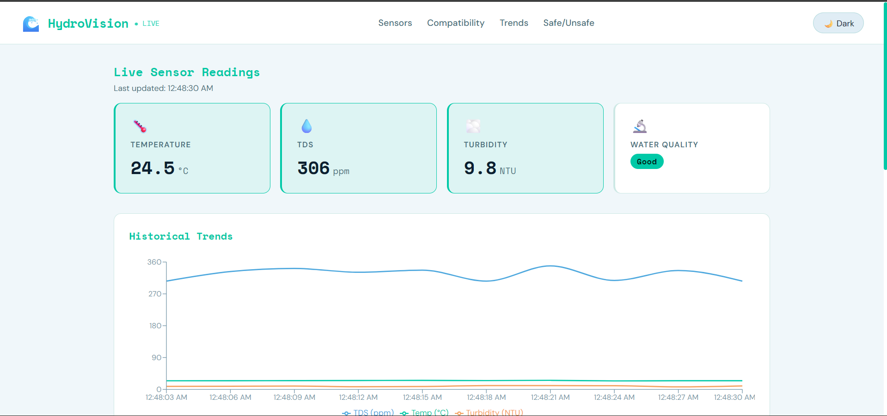
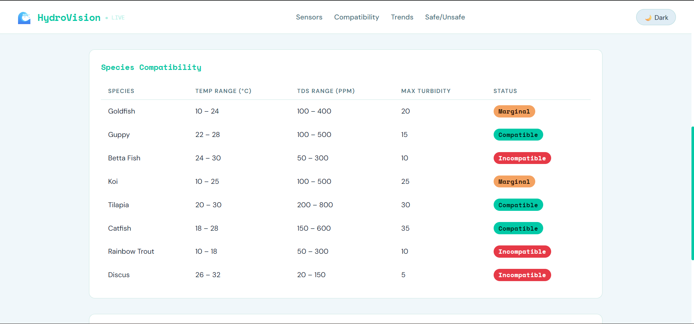
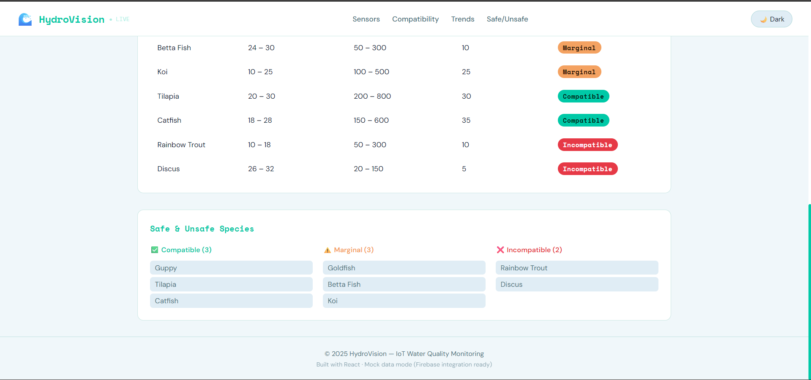

# 🌊 HydroVision — React Dashboard

A React-based frontend dashboard for the HydroVision IoT Water Quality Monitoring System.

> This is the **React rebuild** of the original [HydroVision](https://github.com/AshutoshSinghJ/hydrovision) project, migrated from Vanilla JS to a component-based React architecture.

---

## 🖥️ Live Demo

🔗 https://hydrovision-react.vercel.app/

---

## 📸 Screenshots

### Dashboard Overview



### Species Compatibility Table



### Safe vs Unsafe Species



---

## 🌟 Features

* ⚡ **Simulated live sensor updates** every 3 seconds (mock data)
* 📊 **Real-time line chart** for temperature, TDS, and turbidity trends
* 🐠 **Species compatibility system** — dynamically evaluates safe, marginal, and incompatible species
* ✅ **Auto-classified species lists** based on real-time water conditions
* 🌙 **Dark/Light mode toggle**
* 📱 **Fully responsive dashboard layout**

---

## 🧰 Tech Stack

| Category  | Technology                             |
| --------- | -------------------------------------- |
| Framework | React 18 (Vite)                        |
| Charts    | Recharts                               |
| Styling   | CSS Variables + Google Fonts           |
| Data      | Mock data (Firebase integration ready) |

---

## ⚙️ How It Works

1. `generateLiveSensorData()` simulates ESP32 sensor readings every 3 seconds
2. `App.jsx` manages global state: sensor readings and chart history
3. Components receive sensor data as props and re-render dynamically
4. `getCompatibility()` in `mockData.js` evaluates species based on live conditions

---

## 🧩 Component Architecture

```
App.jsx
├── SensorCard       — displays individual metrics (Temp / TDS / Turbidity / Quality)
├── SensorChart      — Recharts line chart for historical trends
├── SpeciesTable     — compatibility table with dynamic status badges
└── SafeSpecies      — categorized safe / marginal / incompatible species
    └── StatusBadge  — reusable colored badge component
```

---

## 🛠️ Setup

```bash
# 1. Clone
git clone https://github.com/AshutoshSinghJ/hydrovision-react.git
cd hydrovision-react

# 2. Install dependencies
npm install

# 3. Run locally
npm run dev
```

---

## 🔌 Firebase Integration (Future Scope)

To connect real ESP32 sensor data, replace `generateLiveSensorData()` in `App.jsx` with:

```js
import { initializeApp } from "firebase/app";
import { getDatabase, ref, onValue } from "firebase/database";

const db = getDatabase(app);

onValue(ref(db, "sensors/latest"), (snapshot) => {
  setSensor(snapshot.val());
});
```

---

## 🙏 Acknowledgments

* Original HydroVision project built with ESP32, Firebase, and Vanilla JS
* Recharts for React-based data visualization
* Google Fonts (Space Mono + DM Sans)
