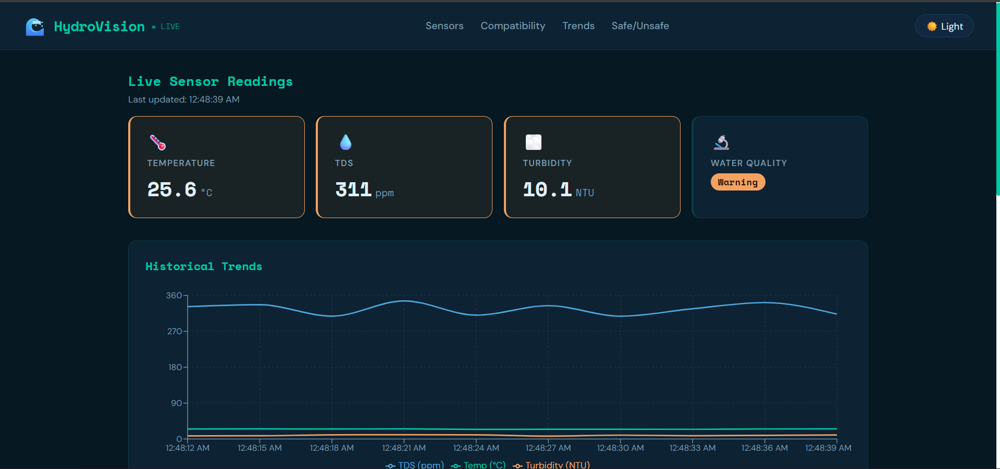

# 🌊 HydroVision — React Dashboard

A React-based frontend dashboard for the HydroVision IoT Water Quality Monitoring System.

> This is the **React rebuild** of the original [HydroVision](https://github.com/AshutoshSinghJ/hydrovision) project, migrated from Vanilla JS to a component-based React architecture.

---

## 🖥️ Live Demo

🔗 https://hydrovision-react.vercel.app/
📂 GitHub: https://github.com/AshutoshSinghJ/hydrovision-react

---

## 📸 Screenshots

### Dashboard Overview



### Species Compatibility Table


### Safe vs Unsafe Species


---

## 🌟 Features

* ⚡ **Simulated real-time sensor updates** every 3 seconds (mock IoT data)
* 📊 **Interactive charts** for temperature, TDS, and turbidity trends
* 🐠 **Species compatibility system** — evaluates safe, marginal, and incompatible species
* ✅ **Dynamic classification** based on current environmental conditions
* 🧩 **Component-based architecture** with reusable and modular UI design
* 🌙 **Dark/Light mode toggle**
* 📱 **Responsive dashboard layout**

---

## 🧰 Tech Stack

| Category  | Technology                                    |
| --------- | --------------------------------------------- |
| Framework | React 18 (Vite)                               |
| Charts    | Recharts                                      |
| Styling   | CSS Variables + Google Fonts                  |
| Data      | Mock data (designed for Firebase integration) |

---

## ⚙️ How It Works

1. `generateLiveSensorData()` simulates ESP32-like sensor readings every 3 seconds
2. `App.jsx` manages global state for sensor data and chart history using `useState`
3. `useEffect` triggers periodic updates for live data simulation
4. Components receive data via props and re-render dynamically
5. `getCompatibility()` evaluates species based on live conditions

---

## 🧩 Component Architecture

```id="v9f6kp"
App.jsx
├── SensorCard       — displays metrics (Temp / TDS / Turbidity / Quality)
├── SensorChart      — Recharts line chart for trends
├── SpeciesTable     — compatibility table with status badges
└── SafeSpecies      — categorized species lists
    └── StatusBadge  — reusable UI component
```

---

## 🛠️ Setup

```bash id="z3w8yb"
# Clone repository
git clone https://github.com/AshutoshSinghJ/hydrovision-react.git
cd hydrovision-react

# Install dependencies
npm install

# Run locally
npm run dev
```

---

## 🔌 Future Improvements

* Integrate Firebase for real-time ESP32 sensor data
* Add filtering/search for species compatibility
* Backend API integration for scalable data handling

---

## 🙏 Acknowledgments

* Original HydroVision project built with ESP32, Firebase, and Vanilla JS
* Recharts for React-based data visualization
* Google Fonts (Space Mono + DM Sans)
